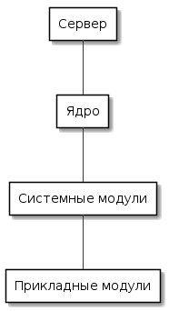
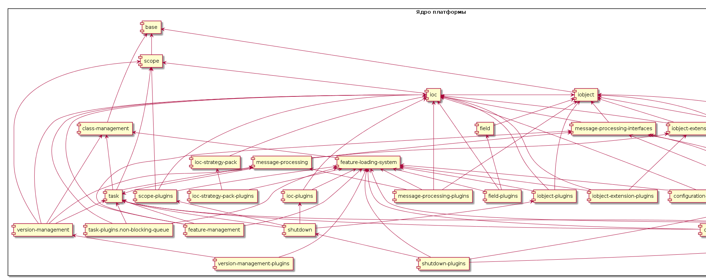

# Концептуальная архитектура платформы Smartactors

Версия 0.0.1

## Введение

Данный документ представляет собой верхнеуровневое описание 
платформы Smartactors, реализующей принципы  
[акторной модели](https://ru.wikipedia.org/wiki/%D0%9C%D0%BE%D0%B4%D0%B5%D0%BB%D1%8C_%D0%B0%D0%BA%D1%82%D0%BE%D1%80%D0%BE%D0%B2).

## Общая архитектура платформы

Платформа Smartactors реализована на языке Java (поддерживается 
версия Java SE Version 8).

Платформа Smartactors состоит из основного серверного приложения,
набора модулей ядра, набора системных модулей и набора модулей, 
реалшизующих пользовательскую функциональность.

Развернутая платформа представляет собой каталог, содержащий 
файлы server.jar, configuration.json, а так же каталоги core, 
corefeatures и features. 

Соответственно, основной модуль платформы - приложение server.jar - 
запускается посредством Java-машины.

Файл configuration.json содержит конфигурации базовых объектов 
и цепочек платформы.

Каталог core содержит все модули ядра платформы.

Каталог corefeatures содержит только те системные модули 
платформы, которые необходимы для реализации пользовательской 
функциональности. 

corefeatures может содержать только один файл features.json, 
вмещающий описания и ссылки на необходимые системные модули. В 
таком случае, эти системные модули будут автоматически загружены 
сервером платформы при старте.

Каталог features содержит набор прикладных модулей, реализующих 
пользовательскую функциональность.

## Основные принципы платформы

### Модульность

Каждый отдельный самостоятельный блок пользовательской 
функциональности должен быть реализован в виде отдельного модуля
(feature). Модуль состоит из набора акторов, плагинов и файла 
конфигурации config.json. Акторы реализуют собственно 
пользовательскую функциональность. Плагины проводят начальную 
инициализацию акторов при загрузке модуля и регистрацию 
необходимых компонент. Файл конфигурации config.json содержит 
описания объектов модуля, цепочек модуля и др.

### Стратегии

Любая единица функциональности (в том числе акторы, создание 
объектов, обработка объекта некоторым способом) регистрируется 
в системном сервис-локаторе (IOC) в виде стратегии под 
соответствующим именем. Для вызова этой функциональности 
производится запрос к IOC на выполнение соответствующией 
стратегии. Таким образом поведение кода может динамически 
меняться путем замены/перерегистрации стратегии без изменения
самого кода.

### Принципы именования классов/интерфейсов/стратегий

Имена классов платформы должны начинаться с заглавной буквы и 
соответствовать "верблюжьей" нотации. Имена должны состоять 
**_только_** из существительных (и, может быть, предлогов) и 
представлять собой осмысленную фразу на английском языке в 
соответствии с его грамматикой. 

Имена интерфейсов должны начинаться с буквы "I" перед заглавной 
буквой первого слова имени.

Имена стратегий должны представлять из себя осмысленное описание 
выполняемого действия на английском языке. Все слова должны 
начинаться с маленькой буквы и быть разделенными пробелами. 
Например: "factor choice strategy" или "my main object creation".
Имя стратегии не должно состоять из более чем 4-6 слов.

## Начало работы с платформой

Для начала работы со Smartactors требуется установить пакет das,
позволяющий производить основные действия с платформой, такие 
как: создание сервера, установка ядра, 
создание/изменение/удаление пользовательских 
модулей/акторов/плагинов, и т.д.

Более подробную документацию по типовым действиям с платформой 
и das можно найти в разделе 
[Quickstart guides](../quickstart/).

## Структура проектов платформы

Платформа Smartactors представляет собой несколько 
maven-проектов: 
* Servers/Server2 содержит основное серверное приложение
* ServerDevelopmentTools содержит основной интерфейс
серверного приложения
* СoreFeatures содержит все модули ядра и системные модули
* CommonFeatures содержит модули с дополнительной 
функциональностью общего назначения
* SystemActors содержит дополнительные системные модули
* ServerPack содержит конфигурационный файл со списком всех 
модулей, входящих в ядро

## Архитектура ядра

Архитектура ядра платформы представлена следующей диаграммой

Таблица со списком модулей ядра и их кратким описанием (в 
список зависимостей не включены модули, от которых зависят 
авто-тесты модуля, а также зависимости от пакетов вне ядра 
платформы).

| | Модуль | Описание | Зависимости | 
| ---: | :--- | --- | --- | 
| 1 | base | Модуль содержит базовые интерфейсы платформы | -- | 
| 2 | class-management | Модуль реализует систему учета модулей, загрузчик классов платформы и систему компиляции классов на лету. | base | 
| 3 | feature-loading-system | Модуль обеспечивает загрузку классов модулей платформы и упорядоченный запуск плагинов модулей в соответствии с их зависимостями. | base | 
| 4 | scope | Модуль реализует поддержку скоупов на платформе. | base | 
| 5 | scope-plugins | Модуль содержит плагины, инициализирующие функциональность скоупов. | base, feature-loading-system, scope, ioc |    
| 6 | iobject | Модуль содержит интерфейсы и их реализацию для работы с json-объектами. | base | 
| 7 | iobject-plugins | Модуль содержит плагины, регистрирующие в ioc стратегии работы с json-объектами. | base, iobject, feature-loading-system, ioc |    
| 8 | iobject-extension | Модуль содержит дополнительные реализации интерфейсов для работы с json-объектами.  | base, iobject, ioc |    
| 9 | iobject-extension-plugins | Модуль содержит плагины, регистрирующие в ioc дополнительные стратегии работы с json-объектами. | base, iobject-extention, feature-loading-system, ioc |    
| 14 | dumpable-interface | Модуль содержит интерфейс создания сериализованной копии объекта. | base, iobject |
| 10 | ioc | Модуль реализует функциональность системного сервис-локатора. | base, iobject, scope |
| 11 | ioc-plugins | Модуль содержит плагины, инициализирующие системный сервис-локатор. | ioc, feature-loading-system | 
| 12 | ioc-strategy-pack | Модуль содержит дополнительные стратегии для работы системного сервис-локатора. |  base, iobject, ioc | 
| 13 | ioc-strategy-pack-plugins | Модуль содержит плагины, регистрирующие дополнительные стратегии для работы с системным сервис-локатором. | base, feature-loading-system, ioc, ioc-plugins  | 
| 24 | configuration-manager | Модуль содуржит интерфейс и реализацию функциональности управления стратегиями загрузки конфигураций из конфигурационных файлов. | base, iobject | 
| 25 | configuration-manager-plugins | Модуль содержит плагины, регистрирующие стратегии управления загрузкой конфигураций из конфигурационных файлов. | base, feature-loading-system, iobject, ioc, configuration-manager | 
| 17 | shutdown | Модуль содержит интерфейсы и стратегии обработки задач завершения. | base, iobject, ioc, task |
| 18 | shutdown-plugins | Модуль содержит плагины, регистрирующие стратегии обработки задач завершения, а также обработки секции завершения файла конфигурации. | base, class-management, feature-loading-system, iobject, ioc, configuration-manager, message-processing-interfaces, task, shutdown | 
| 19 | field | Модуль содержит реализации интерфейса к полю данных. | iobject, ioc |
| 20 | field-plugins | Модуль содержит плагины, регистрирующие стратегии работы с полями данных. | feature-loading-system, iobject, ioc | 
| 21 | message-processing-interfaces | Модуль содержит интерфейсы для контейнеров, стратегий и других базовых компонент обработки сообщений.  |  base, iobject, ioc | 
| 15 | task | Модуль содержит интерфейсы и их реализацию для управления потоком выполняемых задач. | base, dumpable-interface, iobject, scope, class-management, message-processing-interfaces |
| 16 | task-plugins.non-blocking-queue | Модуль содержит плагин, инициализирующий неблокирующую очередь задач платформы. | base, task, feature-loading-system, ioc | 
| 22 | message-processing | Модуль реализует базовую функциональнось платформы для обработки сообщений. | base, message-processing-interfaces, ioc, iobject, class-management, dumpable-interface, task, shutdown, iobject-extension, field |
| 23 | message-processing-plugins | Модуль содержит плагины, регистрирующие стратегии работы с базовыми элементами платформы, такими как сообщения, акторы, цепочки, обработчики, маршрутизаторы, последовательности, обертки и т.д. |  base, feature-loading-system, iobject, ioc, message-processing, task, message-processing-interfaces | 
| 26 | feature-management | Модуль реализует функциональность по загрузке и управлению модулями платформы. | base, class-management, feature-loading-system, iobject, ioc, message-processing-interfaces, task |
| 27 | core-service-starter | Модуль реализует фунциональность загрузки секций объектов, цепочек и исполнителей файла конфигурациии, а также плагин, регистрирующий эту функциональность. | base, feature-loading-system, iobject, iobject-extension, ioc, configuration-manager, task, message-processing-interfaces |
| 28 | on-feature-loading-service-starter | Модуль реализует фунциональность обработки загрузочной секции файла конфигурациии, а также плагин, регистрирующий эту функциональность. | base, class-management, feature-loading-system, message-processing-interfaces, iobject, ioc, configuration-manager, task | 
| 29 | version-management | Модуль реализует функциональность по управлению версионированием модулей на платформе. | base, class-management, scope, iobject, ioc, message-processing-interfaces, message-processing, task | 
| 30 | version-management-plugins | Модуль содержит плагин, регистрирующий стратегии по управлению версионированием модулей платформы. |  base, class-management, feature-loading-system, ioc, task, message-processing, version-management | 

## Архитектура системного слоя

Архитектура системного слоя платформы представлена следующей 
диаграммой

Таблица со списком системных модулей и их кратким описанием

| | Модуль | Описание | Зависимости | 
| ---: | :--- | --- | --- | 
|  | checkpoint | Модуль реализует функциональность контрольных точек при обработке сообщений. | *base, iobject, ioc, message-processing-interfaces, configuration-manager, task,* **dumpable-plugins, scheduler, scheduler-plugins, message_bus** |
|  | checkpoint-plugins | Модуль содержит плагин, регистрирующий акторы и стратегии по управлению контрольными точками. | *base, feature-loading-system, iobject, ioc,* **checkpoint** |
|  | checkpoint-auto-startup | Модуль содержит плагин, инициализирующий планировщик (scheduler) для актора контрольных точек. | *base, feature-loading-system, iobject, ioc, task,* **scheduler, checkpoint-plugins**|
|  | database |  |  |
|  | database-plugins |  |  |
|  | database-in-memory |  |  |
|  | database-in-memory-plugins |  |  |
|  | database-postgresql |  |  |
|  | database-postgresql-plugins |  |  |
|  | database-null-connection-pool-plugins |  |  |
|  | database-postgresql-async-ops-collection |  |  |
|  | database-postgresql-cached-collection |  |  |
|  | database-service-starter |  |  |
|  | debugger |  |  |
|  | debugger-plugins |  |  |
|  | dumpable-plugins |  |  |
|  | endpoint |  |  |
|  | endpoint-plugins |  |  |
|  | endpoint-service-starter |  |  |
|  | global-constants-service-starter |  |  |
|  | helpers |  |  |
|  | http-endpoint |  |  |
|  | http-endpoint-plugins |  |  |
|  | https-endpoint |  |  |
|  | https-endpoint-plugins |  |  |
|  | in-memory-database-service-starter |  |  |
|  | message-bus |  |  |
|  | message-bus-plugins |  |  |
|  | message-bus-service-starter |  |  |
|  | morph-expressions |  |  |
|  | remote-management |  |  |
|  | scheduler |  |  |
|  | scheduler-plugins |  |  |
|  | scheduler-auto-startup |  |  |
|  | security |  |  |
|  | security-plugins |  |  |
|  | statistics |  |  |
|  | statistics-plugins |  |  |
|  | testing |  |  |
|  | testing-plugins |  |  |
|  | timer |  |  |
|  | timer-plugins |  |  |

## Подробное описание модулей ядра и системных модулей

