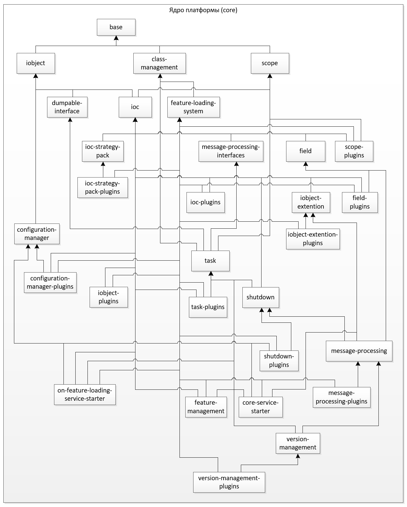
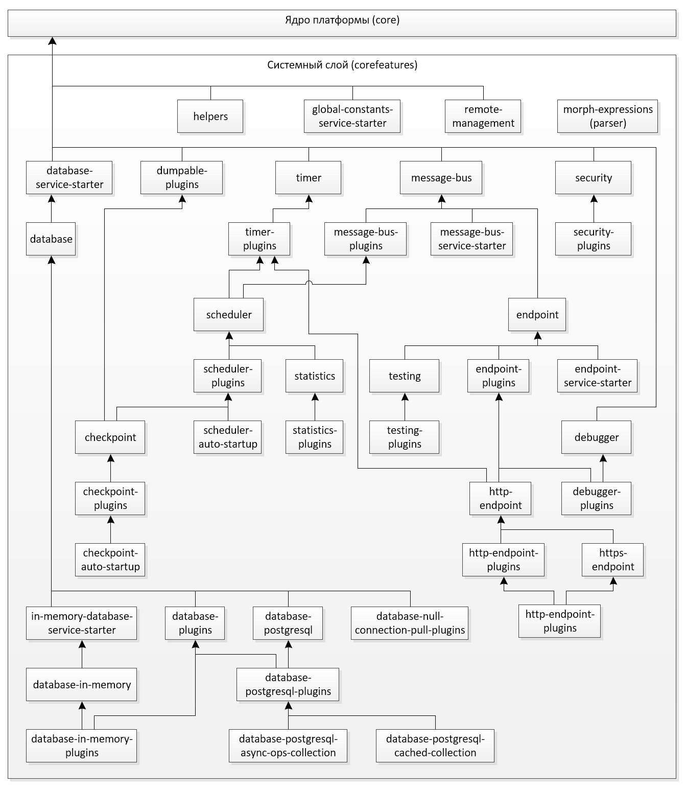

# Концептуальная архитектура платформы Smartactors

Версия 0.0.1

## Введение

Данный документ представляет собой верхнеуровневое описание 
платформы Smartactors, реализующей принципы  
[акторной модели](https://ru.wikipedia.org/wiki/%D0%9C%D0%BE%D0%B4%D0%B5%D0%BB%D1%8C_%D0%B0%D0%BA%D1%82%D0%BE%D1%80%D0%BE%D0%B2).

## Общая архитектура платформы

Платформа Smartactors реализована на языке Java (поддерживается 
версия Java SE Version 8).

Платформа Smartactors состоит из основного серверного приложения,
набора модулей ядра, набора системных модулей и набора модулей, 
реализующих пользовательскую функциональность.

Развернутая платформа представляет собой каталог, содержащий 
файлы server.jar, configuration.json, а так же каталоги core, 
corefeatures и features. 

Соответственно, основной модуль платформы - приложение server.jar - 
запускается посредством Java-машины.

Файл configuration.json содержит конфигурации базовых объектов 
и цепочек платформы.

Каталог core содержит все модули ядра платформы.

Каталог corefeatures содержит только те системные модули 
платформы, которые необходимы для реализации пользовательской 
функциональности. 

corefeatures может содержать только один файл features.json, 
вмещающий описания и ссылки на необходимые системные модули. В 
таком случае, эти системные модули будут автоматически загружены 
сервером платформы при старте.

Каталог features содержит набор прикладных модулей, реализующих 
пользовательскую функциональность.

## Основные принципы платформы

### Модульность

Каждый самостоятельный блок пользовательской 
функциональности должен быть реализован в виде отдельного модуля
(feature). Модуль состоит из набора интерфейсов, акторов, 
плагинов и файла конфигурации config.json. В случае если 
интерфейсы предполагают более чем одну реализацию, они должны 
быть вынесены в отдельный модуль. Акторы реализуют собственно 
пользовательскую функциональность. Плагины проводят начальную 
инициализацию акторов при загрузке модуля и регистрацию 
необходимых компонент/стратегий. Плагины также могут быть вынесены
в отдельный модуль в случае, если требуется отделить инициализацию
и регистрацию компонент от собственно реализации. Файл конфигурации 
config.json содержит описания объектов модуля, цепочек модуля и др.

### Стратегии

Любая единица функциональности (в том числе акторы, создание 
объектов, обработка объекта некоторым способом) регистрируется 
в системном сервис-локаторе (IOC) в виде стратегии под 
соответствующим именем. Для вызова этой функциональности 
производится запрос к IOC на выполнение соответствующией 
стратегии. Таким образом поведение кода может динамически 
меняться путем замены/перерегистрации стратегии без изменения
самого кода.

### Принципы именования классов/интерфейсов/стратегий

Имена классов платформы должны начинаться с заглавной буквы и 
соответствовать "верблюжьей" нотации. Имена должны состоять 
**_только_** из существительных (и, может быть, предлогов) и 
представлять собой осмысленную фразу на английском языке в 
соответствии с его грамматикой. 

Имена интерфейсов должны начинаться с буквы "I" перед заглавной 
буквой первого слова имени.

Имена стратегий должны представлять из себя осмысленное описание 
выполняемого действия на английском языке. Все слова должны 
начинаться с маленькой буквы и быть разделенными пробелами. 
Например: "factor choice strategy" или "my main object creation".
Имя стратегии не должно состоять из более чем 4-6 слов.

## Начало работы с платформой

Для начала работы со Smartactors требуется установить пакет das,
позволяющий производить основные действия с платформой, такие 
как: создание сервера, установка ядра, 
создание/изменение/удаление пользовательских 
модулей/акторов/плагинов, и т.д.

Более подробную документацию по типовым действиям с платформой 
и das можно найти в разделе 
[Quickstart guides](../quickstart/).

## Структура проектов платформы

Платформа Smartactors представляет собой несколько 
maven-проектов: 
* Servers/Server2 содержит основное серверное приложение
* ServerDevelopmentTools содержит основной интерфейс
серверного приложения
* СoreFeatures содержит все модули ядра и системные модули
* CommonFeatures содержит модули с дополнительной 
функциональностью общего назначения
* SystemActors содержит дополнительные системные модули
* ServerPack содержит конфигурационный файл со списком всех 
модулей, входящих в ядро

## Архитектура ядра

Схема зависимостей модулей ядра платформы представлена следующей диаграммой:

Таблица со списком модулей ядра и их кратким описанием (в 
список зависимостей не включены модули, от которых зависят 
авто-тесты модуля, а также зависимости от пакетов вне ядра 
платформы).

| | Модуль | Описание | Зависимости | 
| ---: | :--- | --- | --- | 
| 1 | base | Модуль содержит базовые интерфейсы платформы |  | 
| 2 | class-management | Модуль реализует систему учета модулей, загрузчик классов платформы и систему компиляции классов на лету. | base | 
| 3 | scope | Модуль реализует поддержку скоупов на платформе. | base | 
| 4 | scope-plugins | Модуль содержит плагины, инициализирующие функциональность скоупов. | base, feature-loading-system, scope, ioc |    
| 5 | iobject | Модуль содержит интерфейсы и их реализацию для работы с json-объектами. | base | 
| 6 | iobject-plugins | Модуль содержит плагины, регистрирующие в ioc стратегии работы с json-объектами. | base, iobject, feature-loading-system, ioc |    
| 7 | iobject-extension | Модуль содержит дополнительные реализации интерфейсов для работы с json-объектами.  | base, iobject, ioc |    
| 8 | iobject-extension-plugins | Модуль содержит плагины, регистрирующие в ioc дополнительные стратегии работы с json-объектами. | base, iobject-extention, feature-loading-system, ioc |    
| 9 | dumpable-interface | Модуль содержит интерфейс создания сериализованной копии объекта. | base, iobject |
| 10 | feature-loading-system | Модуль обеспечивает загрузку классов модулей платформы и упорядоченный запуск плагинов модулей в соответствии с их зависимостями. | base, class-management | 
| 11 | ioc | Модуль реализует функциональность системного сервис-локатора. | base, iobject, scope |
| 12 | ioc-plugins | Модуль содержит плагины, инициализирующие системный сервис-локатор. | ioc, feature-loading-system | 
| 13 | ioc-strategy-pack | Модуль содержит дополнительные стратегии для работы системного сервис-локатора. |  base, iobject, ioc | 
| 14 | ioc-strategy-pack-plugins | Модуль содержит плагины, регистрирующие дополнительные стратегии для работы с системным сервис-локатором. | base, feature-loading-system, ioc, ioc-plugins  | 
| 15 | configuration-manager | Модуль содуржит интерфейс и реализацию функциональности управления стратегиями загрузки конфигураций из конфигурационных файлов. | base, iobject | 
| 16 | configuration-manager-plugins | Модуль содержит плагины, регистрирующие стратегии управления загрузкой конфигураций из конфигурационных файлов. | base, feature-loading-system, iobject, ioc, configuration-manager | 
| 17 | field | Модуль содержит реализации интерфейса к полю данных. | iobject, ioc |
| 18 | field-plugins | Модуль содержит плагины, регистрирующие стратегии работы с полями данных. | feature-loading-system, iobject, ioc, field | 
| 19 | message-processing-interfaces | Модуль содержит интерфейсы для контейнеров, стратегий и других базовых компонент обработки сообщений.  |  base, iobject, ioc | 
| 20 | task | Модуль содержит интерфейсы и их реализацию для управления потоком выполняемых задач. | base, dumpable-interface, iobject, scope, class-management, message-processing-interfaces |
| 21 | task-plugins.non-blocking-queue | Модуль содержит плагин, инициализирующий неблокирующую очередь задач платформы. | base, task, feature-loading-system, ioc | 
| 22 | shutdown | Модуль содержит интерфейсы и стратегии обработки задач завершения. | base, iobject, ioc, task |
| 23 | shutdown-plugins | Модуль содержит плагины, регистрирующие стратегии обработки задач завершения, а также обработки секции завершения файла конфигурации. | base, class-management, feature-loading-system, iobject, ioc, configuration-manager, message-processing-interfaces, task, shutdown | 
| 24 | message-processing | Модуль реализует базовую функциональнось платформы для обработки сообщений. | base, message-processing-interfaces, ioc, iobject, class-management, dumpable-interface, task, shutdown, iobject-extension, field |
| 25 | message-processing-plugins | Модуль содержит плагины, регистрирующие стратегии работы с базовыми элементами платформы, такими как сообщения, акторы, цепочки, обработчики, маршрутизаторы, последовательности, обертки и т.д. |  base, feature-loading-system, iobject, ioc, message-processing, task, message-processing-interfaces | 
| 26 | feature-management | Модуль реализует функциональность по загрузке и управлению модулями платформы. | base, class-management, feature-loading-system, iobject, ioc, message-processing-interfaces, task |
| 27 | core-service-starter | Модуль реализует фунциональность загрузки секций объектов, цепочек и исполнителей файла конфигурациии, а также плагин, регистрирующий соответствующую стратегию в менеджере конфигураций (cinfiguration-manager). | base, feature-loading-system, iobject, iobject-extension, ioc, configuration-manager, task, message-processing-interfaces |
| 28 | on-feature-loading-service-starter | Модуль реализует фунциональность обработки загрузочной секции файла конфигурациии, а также плагин, регистрирующий соответствующую стратегию в менеджере конфигураций (cinfiguration-manager). | base, class-management, feature-loading-system, message-processing-interfaces, iobject, ioc, configuration-manager, task | 
| 29 | version-management | Модуль реализует функциональность по управлению версионированием модулей на платформе. | base, class-management, scope, iobject, ioc, message-processing-interfaces, message-processing, task | 
| 30 | version-management-plugins | Модуль содержит плагин, регистрирующий стратегии по управлению версионированием модулей платформы. |  base, class-management, feature-loading-system, ioc, task, message-processing, version-management | 

## Архитектура системного слоя

Схема зависимостей системного слоя платформы представлена следующей 
диаграммой:

Таблица со списком системных модулей и их кратким описанием 
(в список зависимостей не включены модули, от которых зависят 
авто-тесты модуля, а также зависимости от пакетов вне платформы).

| | Модуль | Описание | Зависимости | 
| ---: | :--- | --- | --- | 
|  | morph-expressions | Модуль содержит интерфейсы и реализует функциональность синтаксического анализатора лексем. | * * |
|  | helpers | Модуль содержит базовый абстрактный класс для классов авто-тестов модуля, которым для работы требуется загружать плагины других модулей. | *feature-loading-system* |
|  | dumpable-plugins | Модуль содержит плагин, регистрирующий стратегию создания сериализованной копии объекта через интерфейс dumpable. | *base, feature-loading-system, dumpable-interface, ioc* |
|  | timer | Модуль содержит интерфейс и реализует функциональность таймера. | *base, class-management, ioc, task* |
|  | timer-plugins | Модуль содержит плагин, регистрирующий стратегии работы с таймером. | *base, feature-loading-system, ioc,* **timer** |
|  | message-bus | Модуль содержит интерфейсы и реализацию функционала шины сообщений платформы. | *base, class-management, scope, message-processing-interfaces, iobject, ioc, task* |
|  | message-bus-plugins | Модуль содержит плагин, регистрирующий стратегию обработки ответа на сообщение, отправленное по шине. | *base, feature-loading-system, iobject, ioc,* **message-bus** |
|  | message-bus-service-starter | Модуль реализует фунциональность обработки секции шины сообщений файла конфигурациии, а также плагин, регистрирующий соответствующую стратегию в менеджере конфигураций (cinfiguration-manager). | *class-management, message-processing-interfaces, feature-loading-system, configuration-manager, ioc, task,* **message-bus, message-bus-plugins** |
|  | remote-management | Модуль реализует функциональность (в виде актора и цепочек) удаленной и локальной дозагрузки и перезагрузки модулей без перезапуска сервера, а также получения статистики о загруженных модулях.  | *base, feature-loading-system, iobject, ioc* |
|  | security | Модуль содержит интерфейсы и их реализации для кодировщиков, а также актор с базовой функциональностью шифрования паролей. | *base* |
|  | security-plugins | Модуль содержит плагин, регистрирующий стратегии работы с базовыми кодеками и шифрованием паролей. | *base, feature-loading-system, ioc,* **security** |
|  | scheduler | Модуль содержит актор, интерфейсы и стратегии, реализующие функциональность планировщика. | *base, class-management, message-processing-interfaces, iobject, ioc, task,* **timer, timer-plugins, message_bus, message-bus-plugins** |
|  | scheduler-plugins | Модуль содержит плагины, регистрирующие стратегии работы с планировщиком. | *base, feature-loading-system, ioc,* **scheduler** |
|  | scheduler-auto-startup | Модуль содержит плагин, регистрирующий стратегию инициализации актора планировщика. | *base, feature-loading-system, iobject, ioc, task,* **scheduler, scheduler-plugins** |
|  | statistics | Модуль реализует функциональность сбора статистики о функционировании компонентов платформы. | *base, iobject, ioc, message-processing-interfaces, task, configuration-manager,* **timer, message-bus, scheduler** |
|  | statistics-plugins | Модуль содержит плагины, регистрирующие актор и стратегии для функциональности сбора статистики о функционировании компонентов платформы. | *base, feature-loading-system, iobject, ioc, message-processing-interfaces,* **statistics** |
|  | checkpoint | Модуль реализует функциональность контрольных точек при обработке сообщений. | *base, iobject, ioc, message-processing-interfaces, configuration-manager, task,* **dumpable-plugins, scheduler, scheduler-plugins, message-bus** |
|  | checkpoint-plugins | Модуль содержит плагин, регистрирующий акторы и стратегии по управлению контрольными точками. | *base, feature-loading-system, iobject, ioc,* **checkpoint** |
|  | checkpoint-auto-startup | Модуль содержит плагин, регистрирующий стратегию инициализации актора планировщика (scheduler) для актора контрольных точек. | *base, feature-loading-system, iobject, ioc, task,* **scheduler, checkpoint-plugins**|
|  | endpoint | Модуль реализует функциональность абстрактной точки ввода-вывода сообщений. | *base, class-management, scope, message-processing-interfaces, message-processing, iobject, ioc, task,* **message-bus** |
|  | endpoint-plugins | Модуль содержит плагин, регистрирующий актор и стратегии обработки ответа на сообщения, полученные через точку ввода-вывода (endpoint). | *base, feature-loading-system, iobject, ioc,* **endpoint** |
|  | endpoint-service-starter | Модуль реализует фунциональность обработки секции точки ввода-вывода (endpoint) в файле конфигурациии, а также плагин, регистрирующий соответствующую стратегию в менеджере конфигураций (configuration-manager). | *base, class-management, feature-loading-system, message-processing-interfaces, iobject, ioc, configuration-manager, task,* **endpoint** |
|  | http-endpoint | Модуль реализует функциональность ввода-вывода сообщений по протоколу http. | *base, class-management, scope, feature-loading-system, iobject, ioc, task, message-processing-interfaces, message-processing,* **timer, timer-plugins, endpoint, endpoint-plugins, message-bus** |
|  | http-endpoint-plugins | Модуль содержит плагины, регистрирующие объекты и стратегии для обработки сообщений, полученных через http-точку ввода-вывода (http-endpoint). | *base, feature-loading-system, ioc, message-processing-interfaces,* **timer, endpoint, http-endpoint** |
|  | https-endpoint | Модуль реализует функциональность ввода-вывода сообщений по протоколу https. | *iobject, ioc,* **endpoint, http-endpoint** |
|  | https-endpoint-plugins | Модуль содержит плагины, регистрирующие объекты и стратегии для обработки сообщений, полученных через https-точку ввода-вывода (https-endpoint). | *base, feature-loading-system, message-processing-interfaces, iobject, ioc,* **endpoint, https-endpoint, http-endpoint-plugins** |
|  | database-service-starter | Модуль реализует фунциональность обработки секции database в файле конфигурациии, а также плагин, регистрирующий соответствующую стратегию в менеджере конфигураций (configuration-manager). | *base, feature-loading-system, ioc, configuration-manager, message-processing-interfaces, task, message-processing* |
|  | database | Модуль содержит интерфейсы и реализует базовую функциональность для работы с базой данных. | *base, feature-loading-system, iobject, ioc, field, task,* **database-service-starter** |
|  | database-plugins | Модуль содержит плагины, регистрирующие объекты и стратегии для работы с базой данных. |  *feature-loading-system, ioc,* **database** |
|  | in-memory-database-service-starter | Модуль реализует фунциональность обработки секции inMemoryDb в файле конфигурациии, а также плагин, регистрирующий соответствующую стратегию в менеджере конфигураций (configuration-manager). | *iobject, configuration-manager,* **database** |
|  | database-in-memory | Модуль реализует функциональность работы с базой данных в оперативной памяти. | *base, iobject, ioc, task, ioc-strategy-pack,* **database, in-memory-database-starter** |
|  | database-in-memory-plugins | Модуль содержит плагины, регистрирующие объекты и стратегии для работы с базой данных в оперативной памяти. | *base, feature-loading-system, iobject, ioc,* **database-in-memory, database-plugins** |
|  | database-postgresql | Модуль реализует функциональность работы с базой данных postgresql. | *base, iobject, ioc,* **database** |
|  | database-postgresql-plugins | Модуль содержит плагины, регистрирующие объекты и стратегии для работы с базой данных postgresql. | *base, feature-loading-system, iobject, ioc, ioc-strategy-pack,* **database-postgresql, database-plugins** |
|  | database-postgresql-async-ops-collection | *В настоящее время модуль не функционален. Требуется доработка.* | *base, feature-loading-system, iobject, ioc, ioc-strategy-pack,* **database, database-postgresql, database-plugins, database-postgresql-plugins** |
|  | database-postgresql-cached-collection | *В настоящее время модуль не функционален. Требуется доработка.* | *base, feature-loading-system, iobject, ioc, ioc-strategy-pack,* **database, database-postgresql, database-plugins, database-postgresql-plugins** |
|  | database-null-connection-pool-plugins | Модуль реализует функциональность эмулятора работы с базой данных для использования в тестах. | *base, feature-loading-system, ioc,* **database** |
|  | global-constants-service-starter | Модуль реализует фунциональность обработки секции const в файле конфигурациии, а также плагин, регистрирующий соответствующую стратегию в менеджере конфигураций (configuration-manager). | *base, feature-loading-system, message-processing-interfaces, iobject, ioc, configuration-manager, task, message-processing* |
|  | debugger | Модуль реализует функциональность отладчика пользовательских приложений. | *base, class-management, dumpable-interface, iobject, ioc, message-processing-interfaces* |
|  | debugger-plugins | Модуль содержит плагины, регистрирующие объекты и стратегии для отладки пользовательских приложений. | *base, feature-loading-system, iobject, ioc, message-processing-interfaces,* **debugger, endpoint-plugins** |
|  | testing | Модуль содержит базовую функциональность для создания автоматизированных тестов пользовательских приложений. | *base, class-management, message-processing-interfaces, iobject, ioc, configuration-manager, task,* **endpoint** |
|  | testing-plugins | Модуль содержит плагины, регистрирующие объекты и стратегии базовой функциональности для автоматизированных тестов пользовательских приложений. | *base, feature-loading-system, iobject, ioc,* **testing** |

## Подробное описание модулей ядра и системных модулей

