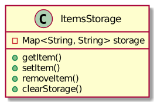

# How to start using SmartActors

## Terminology

Let start from some terms.

__SmartActors__, __DAS__, __Distributed Actor System__ — the framework you're going to use here.

__das__ — the command line tool `das` which helps to initialize the Server.

__Server__ — you need a Server where you put your compiled code and Server will run your code.

__Core__, __Core Pack__ — the initial set of classes (in jars) which is necessary to start the Server from scratch.

__Project__ — it's presumed you work in some Project, to create some Features and Actors to run then on the Server. The source code of the Project is located in a folder separated from the SmartActors sources or place where you run your Server. The Project can be built by a single command.

__Feature__ — a named set of functionality (Actors, Plugins and Maps) to run on the Server. Typically are distributed as zip archives, are extracted to separated folders by the Server. A Feature may depend on other Features.

__Core Feature__ — a Feature, provided by the SmartActors core developers. As any Feature, it gives a new functionality to the Server. It's downloaded automatically when the Server starts. Core Features provide some basic functionality to the Server, while ordinary Features add some specific business logic.

__Actor__ — a Java class which provides the minimal, independent and atomic set of functionality. Actors should be combined to Maps (or Chains) to do something useful within a Feature. Actors in the map receives and sends messages to each other.

__Wrapper__ — an object which is passed to the methods of an Actor. It wraps the actual message passed in the Chain into the interface provided by the author of the Actor. This interface is also called Wrapper.

__Config__ — a `config.json` file, a part of a Feature. Configs from all loaded Features are joined together and form an aggregate config of the Server. The config defines: set of objects to create in the Server's IOC, typically they are Actors; Maps; other metadata and handlers of system events.

__Map__, __Message Map__, __Chain__ — the list of actors in the specified order to process a message step by step. On each step the message is wrapped and passed to the Actor's handler, the Actor makes some modifications in the message atomically, then the message is passed to the next Actor. This is the core idea, how independent Actors work together.

__Plugin__ — a part of a Feature, contains code to initialize the Feature, in most cases registers new strategies in IOC. Plugins may depend on other plugins.

__IOC__, __Inversion of Control__, __IOC Container__ — global "storage" of all objects in the system. The preferable way to take an object in the system is to ask IOC to resolve some parameters and get the object reference.

__Message Receiver__, __Receiver__ — an entity in the system able to receive and process messages. Technically Actor is also such kind of entity, but Actors also support Wrappers and some thread-safety guarantees.

__Endpoint__ — point of the server to receive incoming messages, for HTTP it's a TCP port accepting POSTed JSON documents.

## Requirements

To begin developing with SmartActors framework, you need the following:
* Debian-based Linux distribution
* [OpenJDK](http://openjdk.java.net/install/index.html) 8 run and compile.
  * **Note**: you need `jdk` packages, _not_ `jre`.
* [Apache Maven](https://maven.apache.org/install.html) 3 or later to build your Project.
* Access to [feature repository](http://repository.smart-tools.info) to download necessary packages.
* `das` utility:
  * Download [deb package](https://repository.smart-tools.info/artifactory/smartactors_development_tools/info/smart_tools/smartactors/das/0.6.0/das-0.6.0.deb).
  * Install it with `dpkg` command.
    ```bash
    $ sudo dpkg -i das-0.6.0.deb
    ```
* IDE like [IntelliJ IDEA](https://www.jetbrains.com/idea/) to write a code.
* Template archetype for project feature, it can be accessed [here](https://github.com/SmartTools/feature-archetype). There you can also read how to install in into your system.

## Creating the project

Make sure the `das` utility is installed correctly.

```console
$ das
Distributed Actor System. Design, assembly and deploy tools.
Version 0.6.0.
```

This Project is to make a simple application to keep in memory a list of items. The application has methods to add new items and list all of them. Think of items as a simplest abstraction for, for example, blog posts, etc...

### Project folder

To create project folder all you need is to use `mkdir` command. Although there're some thing that you need to keep in mind:
* Project folder must contain at least `Features` and `ServerParts` folders
* All configuration for the project should be stored outside of these two folders

For more detailed description on project structure, please refer to [this document](project_structure). It's also recommended to use Makefile from that document to help you with feature generation and server start. From this point on, we'll refer to that Makefile.

Also we recommend to check out the project template in `src/template` in tutorial's [repository](https://github.com/SmartTools/tutorials). You'll need all files available there in order to run the project.

### Creating feature

Go to project's folder:

```bash
$ cd project
```

Use this command to generate your first feature:

```bash
$ make cf artId="items-storage" artPack="items_storage"
```

Here we can see that we're creating a feature called `items-storage`, where we'll store our items in memory. Please note the difference in two arguments. `artId` arguments is for SmartActors framework, while `artPack` is the Java package.

Check the content of the feature by going to the folder containing it:
```bash
$ cd Features/items-storage
$ ls
API.md  bin.xml  config.json  pom.xml  README.md  src
```

These are the files and directories located in the feature folder:
* `API.md` - file describing API call for an external chain, if it exists in the feature,
* `bin.xml` - configuration for feature distribution.
* `config.json` - configuration file for the feature, where chains are located. It also helps SmartActors to resolve dependency tree on runtime.
* `pom.xml` - since feature is basically a Maven module, this file describes feature as a Maven module. Here developer can add various dependencies, change the way feature is built, etc.
* `README.md` - file with info about the feature
* `src` - Java code of actors, plugins and other classes used in the feature.

### Actor and plugin

After we've created template for our feature, we already have some template code for us to handle. That will ease development process. We only need to modify that template code according to our needs.

So, what we need now is to create the actor which stores some data in the memory and gives access to it to the user.

Here's the diagram representation of this actor:



As you can see, it has 4 handlers, they allow end user to modify internal state of the actor. It's important to have these kind of handlers, since we're dealing with so called **stateful actor** - an actor with some state in it. After the project is compiled, there's no way to influence on it's state, so it's important to have handlers that allow to modify state.

#### Writing exceptions

When it comes to exceptions, you need to keep in mind that each handler and constructor should throw different exception. In this case, we'll have 5 exception classes:
* `ItemsStorageException` - exception for constructor
* `GetItemException` - exception for `getItem()` handler
* `SetItemException` - exception for `setItem()` handler
* `RemoveItemException` - exception for `removeItem()` handler
* `ClearStorageExcepton` - exception for `clearStorage()` handler

Since they're all mostly the same, this example will contain only one exception. But later in this document it's assumed that you have all 6 exceptions in your project.

```java
package com.example.your_project.items_storage.actors;

public class ItemsStorageException extends Exception {
    
    public ItemsStorageException(final String message) {
        super(message);
    }

    public ItemsStorageException(final String message, final Throwable cause) {
        super(message, cause);
    }
}
```

#### Writing wrappers

Wrappers are interfaces to the data the Actor need access to or provides.

As we defined earlier, our actor contains 5 handlers plus constructor. It means that we'll have 6 wrappers - one for each handler and one for constructor. We'll describe each wrapper separately.

##### ItemsStorageConfig
This wrapper is used in constructor for configuring stateful actors. In this case wrapper is pretty simple - we pass implementation of `Map` interface to the actor. Note that getter throws `ReadValueException`, if it's unable to get map.

```java
package com.example.your_project.items_storage.actors;

import info.smart_tools.smartactors.iobject.iobject.exception.ReadValueException;

import java.util.Map;

public interface ItemsStorageConfig {
    
    Map<String, String> getMap() throws ReadValueException;
}
```

Please note that while source code for wrappers for handlers are generated in runtime, you'll have to write code for wrapper for constructor by yourself. But we'll touch that in plugin section of this documentation

##### GetItemMessage
This wrapper is used in handler for getting single item from the storage. It has one getter and one setter.

```java
package com.example.your_project.items_storage.actors;

import info.smart_tools.smartactors.iobject.iobject.exception.ChangeValueException;
import info.smart_tools.smartactors.iobject.iobject.exception.ReadValueException;

public interface GetItemMessage {
    
    String getKey() throws ReadValueException;
    
    void setValue(String value) throws ChangeValueException;
}
```

As it was said before, source code for wrappers for handlers is generated in runtime. It means that there're certain criteria for wrappers. You can see it in exceptions that are thrown by each field.

##### SetItemMessage
This wrapper is used in handler for adding new or updating existing item in the storage.

```java
package com.example.your_project.items_storage.actors;

import info.smart_tools.smartactors.iobject.iobject.exception.ReadValueException;

public interface SetItemMessage {

    String getKey() throws ReadValueException;

    String getValue() throws ReadValueException;
}
```

##### RemoveItemMessage
This wrapper is used in handler for removing item from the storage

```java
package com.example.your_project.items_storage.actors;

import info.smart_tools.smartactors.iobject.iobject.exception.ChangeValueException;
import info.smart_tools.smartactors.iobject.iobject.exception.ReadValueException;

public interface RemoveItemMessage {

    String getKey() throws ReadValueException;

    void setValue(String value) throws ChangeValueException;
}
```

Note that it's almost exactly the same as `GetItemMessage`, but with different name. If we're dealing with actor with several handlers, each handler must use wrapper designated for it. Even if it means that there will be duplicates like this.

##### ClearStorageMessage
This wrapper is used in handler for clearing internal storage. And because this handler does not require any additional fields, this wrapper is left empty, without any field.

```java
package com.example.your_project.items_storage.actors;

public interface ClearStorageMessage {
}
```

#### Writing actor
When we have all necessary exceptions and wrappers, we can start writing our actor. It must contain 4 handlers and constructor. Handlers must be `public void` and throw exception designated for them.

```java
package com.example.your_project.items_storage.actors;

import info.smart_tools.smartactors.iobject.iobject.exception.ChangeValueException;
import info.smart_tools.smartactors.iobject.iobject.exception.ReadValueException;

import java.util.Map;

public class ItemsStorage {

    private Map<String, String> storage;

    public ItemsStorage(final ItemsStorageConfig config) throws ItemsStorageException {
        try {
            storage = config.getMap();
        } catch (ReadValueException e) {
            throw new ItemsStorageException("Unable to get map object from the config", e);
        }
    }

    public void get(final GetItemMessage message) throws GetItemException {
        try {
            String key = message.getKey();
            String value = storage.get(key);
            message.setValue(value);
        } catch (ReadValueException e) {
            throw new GetItemException("Unable to get key from the message", e);
        } catch (ChangeValueException e) {
            throw new GetItemException("Unable to set value to the message", e);
        }
    }

    public void set(final SetItemMessage message) throws SetItemException {
        try {
            String key = message.getKey();
            String value = message.getValue();
            storage.put(key, value);
        } catch (ReadValueException e) {
            throw new SetItemException("Unable to get data from the message", e);
        }
    }

    public void remove(final RemoveItemMessage message) throws RemoveItemException {
        try {
            String key = message.getKey();
            String value = storage.remove(key);
            message.setValue(value);
        } catch (ReadValueException e) {
            throw new RemoveItemException("Unable to get key from the message", e);
        } catch (ChangeValueException e) {
            throw new RemoveItemException("Unable to set removed value to the message", e);
        }
    }

    public void clear(final ClearStorageMessage message) throws ClearStorageException {
        try {
            storage.clear();
        } catch (UnsupportedOperationException e) {
            throw new ClearStorageException("Unable to clear internal storage", e);
        }
    }
}
```

##### Testing actor

You can see that our ItemsStorage actor mostly using interfaces, allowing us to easily test it.
It's possible to test it completely independently by mock implementations of the wrappers.
You can use [Mockito](http://site.mockito.org/) for it.

Note that while it is recommended to test it fully (i.e. 100% test coverage), we'll test only one handler. Other handlers may be tested in similar manner.

```java
package com.example.your_project.items_storage.actors;

import info.smart_tools.smartactors.iobject.iobject.exception.ChangeValueException;
import info.smart_tools.smartactors.iobject.iobject.exception.ReadValueException;
import org.junit.Before;
import org.junit.Test;
import org.mockito.ArgumentCaptor;
import org.mockito.Captor;
import org.mockito.Mock;
import org.mockito.MockitoAnnotations;

import java.util.Map;

import static org.junit.Assert.assertEquals;
import static org.mockito.Matchers.any;
import static org.mockito.Matchers.anyString;
import static org.mockito.Mockito.doReturn;
import static org.mockito.Mockito.doThrow;
import static org.mockito.Mockito.verify;

public class TestItemsStorage {

    private ItemsStorage actor;

    @Mock
    private Map<String, String> map;

    @Mock
    private GetItemMessage message;

    @Captor
    private ArgumentCaptor<String> captor;

    @Before
    public void init() throws Exception {
        MockitoAnnotations.initMocks(this);
        ItemsStorageConfig config = new ItemsStorageConfig() {
            @Override
            public Map<String, String> getMap() throws ReadValueException {
                return map;
            }
        };
        actor = new ItemsStorage(config);
    }

    @Test
    public void testGetValue() throws Exception {
        doReturn("value").when(map).get(any());
        doReturn("key").when(message).getKey();

        actor.get(message);

        verify(message).getKey();
        verify(message).setValue(captor.capture());
        assertEquals("value", captor.getValue());
    }

    @Test(expected = GetItemException.class)
    public void testGetKeyException() throws Exception {
        doThrow(new ReadValueException()).when(message).getKey();

        actor.get(message);

        verify(message).getKey();
    }

    @Test(expected = GetItemException.class)
    public void testSetValueException() throws Exception {
        doReturn("value").when(map).get(any());
        doReturn("key").when(message).getKey();
        doThrow(new ChangeValueException()).when(message).setValue(anyString());

        actor.get(message);

        verify(message).getKey();
    }
}
```

#### Writing plugin

Simply writing actor won't do anything to it. Without plugin, it won't appear in system IOC. To register actor in IOC, we must do it in the correspoding plugin.

Since plugin is an integral part of SmartActors framework, it must extend `BoostrapPlugin` class and have two methods annotated with `@Item` and `@ItemRevert` respectively. The first method will register actor in the IOC, while the second one will remove actor from IOC if necessary.

```java
package com.example.your_project.items_storage.plugins;

import com.example.your_project.items_storage.actors.ItemsStorage;
import com.example.your_project.items_storage.actors.ItemsStorageConfig;
import com.example.your_project.items_storage.actors.ItemsStorageException;
import info.smart_tools.smartactors.base.exception.invalid_argument_exception.InvalidArgumentException;
import info.smart_tools.smartactors.base.interfaces.iaction.exception.FunctionExecutionException;
import info.smart_tools.smartactors.base.strategy.apply_function_to_arguments.ApplyFunctionToArgumentsStrategy;
import info.smart_tools.smartactors.feature_loading_system.bootstrap_plugin.BootstrapPlugin;
import info.smart_tools.smartactors.feature_loading_system.interfaces.ibootstrap.IBootstrap;
import info.smart_tools.smartactors.iobject.iobject.exception.ReadValueException;
import info.smart_tools.smartactors.ioc.iioccontainer.exception.RegistrationException;
import info.smart_tools.smartactors.ioc.iioccontainer.exception.ResolutionException;
import info.smart_tools.smartactors.ioc.iioccontainer.exception.DeletionException;
import info.smart_tools.smartactors.ioc.key_tools.Keys;
import info.smart_tools.smartactors.ioc.ioc.IOC;

import java.util.HashMap;
import java.util.Map;

public class ItemsStoragePlugin extends BootstrapPlugin {

    public ItemsStoragePlugin(final IBootstrap bootstrap) {
        super(bootstrap);
    }

    @Item("items-storage-plugin")
    public void init()
            throws ResolutionException, RegistrationException, InvalidArgumentException {
        IOC.register(Keys.getKeyByName("items storage"), new ApplyFunctionToArgumentsStrategy(
                args -> {
                    try {
                        ItemsStorageConfig config = new ItemsStorageConfig() {
                            @Override
                            public Map<String, String> getMap() throws ReadValueException {
                                return new HashMap<>();
                            }
                        };

                        return new ItemsStorage(config);
                    } catch (ItemsStorageException e) {
                        throw new FunctionExecutionException("Unable to register 'items storage' actor");
                    }
                }
        ));
    }

    @ItemRevert("items-storage-plugin")
    public void unregister() throws ResolutionException, DeletionException {
        IOC.unregister(Keys.getKeyByName("items storage"));
    }
}
```

##### Testing plugin
Though it might look that plugin does not require any testing, because it's doing only one job - registering and unregistering actor in the IOC, it should be tested too. And because it's working with SmartActors infrastructure, plugin testing is a little bit different from usual actor testing.

The most important thing in plugin testing is that there should be IOC mock provided by `IOCInitializer` abstract class. It'll allow us to register actor and attempt to resolve it.

```java
package com.example.your_project.items_storage.plugins;

import com.example.your_project.items_storage.actors.ItemsStorage;
import info.smart_tools.smartactors.helpers.IOCInitializer.IOCInitializer;
import info.smart_tools.smartactors.ioc.iioccontainer.exception.ResolutionException;
import info.smart_tools.smartactors.ioc.ioc.IOC;
import info.smart_tools.smartactors.ioc.key_tools.Keys;
import org.junit.Test;

import static org.junit.Assert.assertTrue;

public class TestItemsStoragePlugin extends IOCInitializer {

    @Override
    protected void registry(String... strings) throws Exception {
        registryStrategies("ifieldname strategy", "iobject strategy");
    }

    @Test
    public void testRegisterSuccessful() throws Exception {
        ItemsStoragePlugin plugin = new ItemsStoragePlugin(null);
        plugin.init();
        Object object = IOC.resolve(Keys.getKeyByName("items storage"));
        assertTrue(object instanceof ItemsStorage);
    }

    @Test(expected = ResolutionException.class)
    public void testRegisterUnsuccessful() throws Exception {
        IOC.resolve(Keys.getKeyByName("items storage"));
    }

    @Test(expected = ResolutionException.class)
    public void testUnregisterSuccess() throws Exception {
        ItemsStoragePlugin plugin = new ItemsStoragePlugin(null);
        plugin.init();
        Object object = IOC.resolve(Keys.getKeyByName("items storage"));
        assertTrue(object instanceof ItemsStorage);
        plugin.unregister();
        IOC.resolve(Keys.getKeyByName("items storage"));
    }
}
```

### Configuring features

After writing actor, plugin and tests for them, we can finally work on configuring feature. Declare our actor in `objects` section of the feature like in the example below.

Note that we're using `actor` as a kind, because we're dealing with stateful actor and we need to build up a query for handlers to process correctly. If actor does not require any query for handlers, then `stateless_actor` can be used.

```json
{
  "featureName": "com.example.your-project:items-storage",
  "afterFeatures": [],
  "objects": [
    {
      "name": "items-storage",
      "kind": "actor",
      "dependency": "items storage"
    }
  ]
}
```

After that, we can start our project by executing these commands:
- `make download_core` - download core feature necessary for the server to work, it should be done once. Please note that you should have `core-pack.json` present in your project for core features to download
- `make install_features` - build our features and put them in the server directory
- `make start_server` - start SmartActors server

After you've executed these three commands, you'll see following in your terminal:

```console
...skipping core features loading...

[INFO] Start unzipping/copying feature '*unknown*:items-storage:0.1.0'.
[OK] -------------- Feature 'com.example.your-project:items-storage:0.1.0' unzipped/copied successfully.
[INFO] Start loading feature 'com.example.your-project:items-storage:0.1.0'.
[OK] Initial load of plugin "items-storage-plugin" done.
[OK] -------------- Feature 'com.example.your-project:items-storage:0.1.0' loaded successfully.


[INFO] Feature group has been loaded: [
com.example.your-project:items-storage:0.1.0 - (OK)]
[INFO] elapsed time - 00:00:00.212.

```

If you see this, then your feature has been successfully loaded. However, there's one problem - we can't access it. Why we were writing so many handlers for the stateful actor, if we can't simply access it when the server started?

And here's comes another part in feature development - we need to write additional features to access our newly written actor. We need to write 4 features:
* `get-item`
* `set-item`
* `remove-item`
* `clear-storage`

And on top of that, we need additional feature, `endpoint-configuration`. This feature is necessary for our application to be able to receive requests and send responses. We'll write it in the first place.

#### Endpoint configuration
Run `make cf artId="endpoint-configuration" artPack="endpoint_configuration"` and remove `src` folder from generated feature, we won't need it in this feature. Modify it's `config.json` as in the code example below.

```json
{
  "featureName": "com.example.your-project:endpoint-configuration",
  "afterFeatures": [
    "info.smart_tools.smartactors:http-endpoint-plugins",
    "info.smart_tools.smartactors:message-bus-plugins"
  ],
  "objects": [
    {
      "name": "router",
      "kind": "raw",
      "dependency": "info.smart_tools.smartactors.message_processing.chain_call_receiver.ChainCallReceiver",
      "strategyDependency": "chain choice strategy"
    },
    {
      "name": "response-sender",
      "kind": "raw",
      "dependency": "response sender receiver"
    }
  ],
  "maps": [
    {
      "id": "routing-chain",
      "externalAccess": false,
      "steps": [
        {
          "target": "router"
        }
      ],
      "exceptional": []
    }
  ],
  "endpoints": [
    {
      "name": "mainHttpEp",
      "type": "http",
      "port": 9909,
      "startChain": "routing-chain",
      "maxContentLength": 4096,
      "stackDepth": 5
    }
  ]
}
```

Here's what we're doing in this feature:
- We're declaring that our feature `endpoint-configuraion` will load after features `http-endpoint-plugins` and `message-bus-plugins`
- Chain `routing-chain` is used to route between different chains available in the project
- We're limiting the size of the request, it should be no more than 4096 bytes
- We're only able to go down as deep as 5 chains using various routing mechanisms

Take a closer look at `externalAccess` field in chain configuration. This field declares if chain can be accessed from HTTP endpoint or not. We'll use it in features that access our actor.

#### get-item feature
To access `get` handler in our actor, we need to write chain that gives us the ability to get item from the `items-storage` actor and send it back to the user. Here's how it looks like:

```json
{
  "featureName": "com.example.your-project:get-item",
  "afterFeatures": [
    "com.example.your-project:endpoint-configuration",
    "com.example.your-project:items-storage"
  ],
  "maps": [
    {
      "id": "get-item",
      "externalAccess": true,
      "steps": [
        {
          "target": "items-storage",
          "handler": "get",
          "wrapper": {
            "in_getKey": "message/key",
            "out_setValue": "response/value"
          }
        },
        {
          "target": "response-sender"
        }
      ],
      "exceptional": []
    }
  ]
}
```

Before we'll do other chains, we need to discuss how actors are working in chains. In traditional actor model, message (which is basically a bunch of data) comes through special message bus, and actors take what they need, perform some action upon data and outputs back it to the message bus. In SmartActors this process is more linear - we still have message, actors, but they're places in a specific order of execution. So in this case `items-storage` actor will be called first, then `response-sender`.

To access message fields, `message/` prefix is used. It is where user request is stored, actors usually work with it. Prefix `response/` is basically the same as the message, but it will be send to the user after this chain is completed.

#### set-item feature
To set new item or update existing one we'll create feature `set-item`, which will use `set` handler.

```json
{
  "featureName": "com.example.your-project:set-item",
  "afterFeatures": [
    "com.example.your-project:endpoint-configuration",
    "com.example.your-project:items-storage"
  ],
  "maps": [
    {
      "id": "set-item",
      "externalAccess": true,
      "steps": [
        {
          "target": "items-storage",
          "handler": "set",
          "wrapper": {
            "in_getKey": "message/key",
            "in_getValue": "message/value"
          }
        },
        {
          "target": "response-sender"
        }
      ],
      "exceptional": []
    }
  ]
}
```

Note that while we don't set anything to the `response` object, we still need to send some kind of the response to the user, otherwise he`ll receive `500 Internal Server Error`.

#### remove-item feature
To remove any existing item from the storage, we'll create `remove-item` feature.

```json
{
  "featureName": "com.example.your-project:remove-item",
  "afterFeatures": [
    "com.example.your-project:endpoint-configuration",
    "com.example.your-project:items-storage"
  ],
  "maps": [
    {
      "id": "remove-item",
      "externalAccess": true,
      "steps": [
        {
          "target": "items-storage",
          "handler": "remove",
          "wrapper": {
            "in_getKey": "message/key",
            "out_setValue": "response/value"
          }
        },
        {
          "target": "response-sender"
        }
      ],
      "exceptional": []
    }
  ]
}
```

#### clear-storage feature
To remove all existing items in storage, we'll create `clear-storage` feature.

```json
{
  "featureName": "com.example.your-project:clear-storage",
  "afterFeatures": [
    "com.example.your-project:endpoint-configuration",
    "com.example.your-project:items-storage"
  ],
  "maps": [
    {
      "id": "clear-storage",
      "externalAccess": true,
      "steps": [
        {
          "target": "items-storage",
          "handler": "clear",
          "wrapper": {}
        },
        {
          "target": "response-sender"
        }
      ],
      "exceptional": []
    }
  ]
}
```

Note that because wrapper for `clear` handler does not have any field, we leave `wrapper` object empty. But it should be present, otherwise chain will not load properly.

## Running the server

After you've created remaining features, build the project using `make install_features` and start it with `make start_server`. If everything goes well, you'll see this:

```console

[INFO] Feature group has been loaded: [
com.example.your-project:get-item:0.1.0 - (OK), 
com.example.your-project:clear-storage:0.1.0 - (OK), 
com.example.your-project:endpoint-configuration:0.1.0 - (OK), 
com.example.your-project:set-item:0.1.0 - (OK), 
com.example.your-project:items-storage:0.1.0 - (OK), 
com.example.your-project:remove-item:0.1.0 - (OK)]
[INFO] elapsed time - 00:00:00.244.

```

Then you can test your application by sending POST requests with JSON body to `localhost:9909`, since we've configured endpoint to receive requests on port 9909.

**Getting non-existing item**

```bash
$ curl --request POST \
    --url http://localhost:9909/ \
    --header 'content-type: application/json' \
    --data '{
  "messageMapId": "get-item",
  "key": "obj"
  }'

$ {"value":null}
```

**Adding new item and then getting it**

```bash
$ curl --request POST \
    --url http://localhost:9909/ \
    --header 'content-type: application/json' \
    --data '{
  "messageMapId": "set-item",
  "key": "obj",
  "value": "example value"
  }'
$ {}
```

```bash
$ curl --request POST \
    --url http://localhost:9909/ \
    --header 'content-type: application/json' \
    --data '{
  "messageMapId": "get-item",
  "key": "obj"
  }'
$ {"value":"example value"}
```

**Removing created value**

```bash
$ curl --request POST \
    --url http://localhost:9909/ \
    --header 'content-type: application/json' \
    --data '{
  "messageMapId": "remove-item",
  "key": "obj"
  }'
$ {"value":"example value"}
```

```bash
$ curl --request POST \
    --url http://localhost:9909/ \
    --header 'content-type: application/json' \
    --data '{
  "messageMapId": "get-item",
  "key": "obj"
  }'
$ {"value":null}
```

**Clearing internal storage**

```bash
$ curl --request POST \
    --url http://localhost:9909/ \
    --header 'content-type: application/json' \
    --data '{
  "messageMapId": "clear-storage"
  }'
$ {}
```
