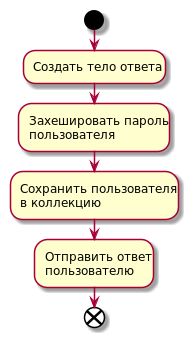
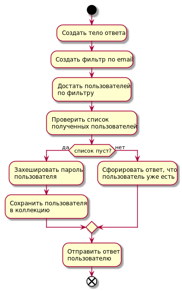

# Модули и цепочки
## Введение
Данный раздел документации предназначен для описания принципов работы с модулями (features) и цепочками (chains).

## Описание
Модули (features) - самостоятельный блок пользовательской функциональности, который реализуется разработчиком. В зависимости от типа и сложности модуля, он может быть модулем ядра (core), системным модулем (corefeatures) или прикладным модулем (features).

Цепочки (chains) - часть модуля, выполняющая некоторую функцию, заданную в процессе разработки. Состоит из акторов, в процессе выполнения может ссылаться на другие цепочки.

## Подходы и рекомендации
В процессе разработки веб-сервера на SmartActors разработчик в общем случае оперирует с прикладными модулями, но принципы, описанные в этой документации, накладываются и на остальные типы модулей.

### Итеративная разработка
При разработке модуля следует придерживаться [метода прогрессивного джипега](https://www.artlebedev.ru/kovodstvo/sections/167/), здесь это выражается в том, что модуль в любой момент времени должен быть готовым и работоспособным. Некоторых деталей может не хватать, но это не влияет на общую работоспособность.

В общем случае итеративная разработка модуля может выглядеть следующим образом:
1. Определяется, что должен делать модуль. На данном этапе рассматривается минимальная функциональность, которой должно быть достаточно для работоспособности модуля.
2. Описываются акторы и цепочки, которые будут в модуле на данном этапе. Описание должно быть достаточно подробным, чтобы за работу мог взяться любой другой человек, который работает на проекте.
3. Реализуется функциональность, определенная на шаге 1 используя описание из шага 2.
4. Определяется, что необходимо доработать в модуле, какую функциональность надо добавить. Здесь стоит учитывать, что добавлять новую функциональность следует не огромной кучей за раз, а шаг за шагом.
5. Аналогично шагу 2 описываются цепочки и акторы, которые необходимо добавить.
6. В модуль добавляется новая функциональность, определенная на шаге 4 с описанием из шага 5.
7. Повторяйте шаги 4-6 до тех пор, пока модуль не приобрет необходимый вам вид.

#### Пример
Рассмотрим итеративную разработку на примере модуля регистрации пользователя.

1. Определяем, какой минимум должен делать модуль. Он должен сделать следующее - получить информацию о новом пользователе, положить его в коллекцию и сообщить, что пользователь зарегистрирован.
2. Определяем акторы и цепочки, необходимые для первой версии модуля. С учетом описанного выше, получаем следующий набор:
    1. Цепочка называется `sign-up`
    2. Актор для формирования пустого ответа
    3. Актор для хеширования пароля пользователя
    4. Актор для сохранения пользователя в коллекцию
    5. Системный актор для отправки ответа пользователю

    

    Стоит учесть, что для упрощения здесь не указывается информация об обертках каждого актора, но при планировании модуля обязательно надо указывать, с какими полями сообщения будет идти работа.
3. Разрабатывается модуль с учетом описания из шага 2. Это будет версия 1.0.0.
4. Определяем, что необходимо добавить в следующую версию модуля. Для регистрации необходимо проверять, существует ли пользователь в системе или нет. Поэтому в следующей версии модуля будет добавлена проверка на наличие пользователя с email, указанным при регистрации.
5. Описываем цепочку для второй версии модуля. Получаем цепочку следующего вида (здесь **жирным** выделены акторы, которые будут добавлены в новой версии):
    1. Цепочка называется `sign-up`
    2. Актор для формирования пустого ответа
    3. **Актор для формирования фильтра по email**
    4. **Актор для получения пользователей из коллекции по фильтру**
    5. **Актор для проверки на пустоту списка пользователей**
    6. **Актор для формирования сообщения об ошибке, если пользователь существует**
    7. Актор для хеширования пароля пользователя
    8. Актор для сохранения пользователя в коллекцию
    9. Системный актор для отправки ответа пользователю

    

    Отдельно стоит отметить, что в данном случае хоть и предполагается, что все расположено в одной цепочке и одном модуле, рекомендуется все же выносить новую функциональность в отдельную цепочку и отдельный модуль. Делается это для того, чтобы новую функциональность можно было подключать и в другие модули.
6. Разрабатываем новую версию модуля с учетом описания из шага 5. Это будет версия 1.1.0.
7. Шаги 4-6 повторяются до тех пор, пока модуль регистрации не будет доработан до нужного уровня.

### Открытые цепочки
Каждая цепочка может быть открытой или закрытой, это выражается в том, что на неё можно отправить HTTP-запрос, и цепочка примет его. Если в модуле есть открытая цепочка, то она подлежит описанию во внешнем файле, например, `API.md`. В нём описывается входной запрос, параметры его, ответ и возможные ошибки.

Общая рекомендация по работе с открытыми цепочками следующая - в одном модуле может быть только одна открытая цепочка. Делается это по двум причинам:
1. Документация будет описывать только одну цепочку, она не будет содержать полотно, описывающее большое количество цепочек.
2. Модуль должен быть настолько независимым, чтобы его можно было без проблем потенциально переиспользовать. Чем больше открытых цепочек в одном модуле, тем выше вероятность того, что у этого модуля будет большое дерево зависимостей, без которых он не будет работать.

Также рекомендуется для открытых цепочек формировать тело ответа непосредственно в самом начале выполнения цепочки, чтобы в процессе выполнения цепочки информация для ответа постепенно добавлялась в тело ответа.